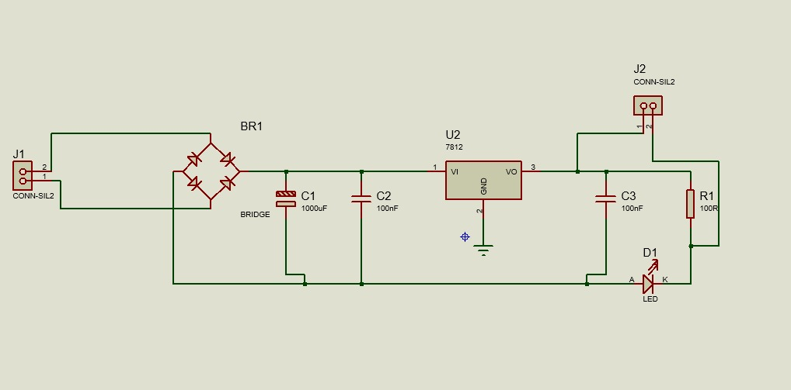
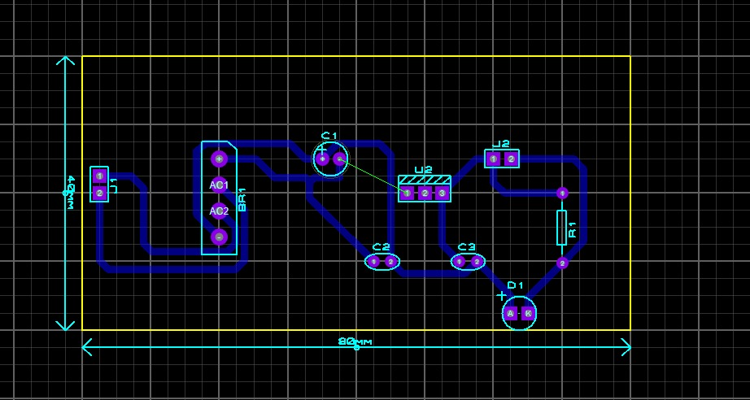
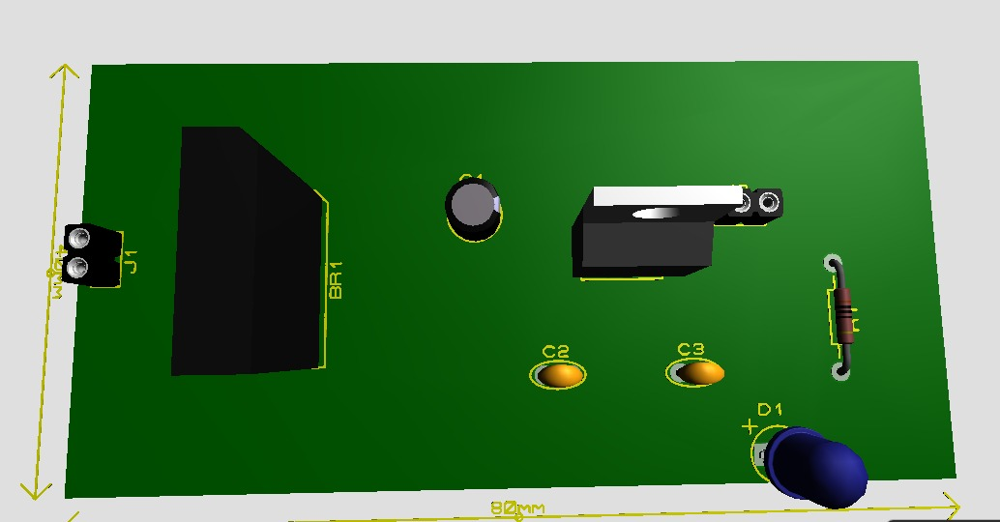
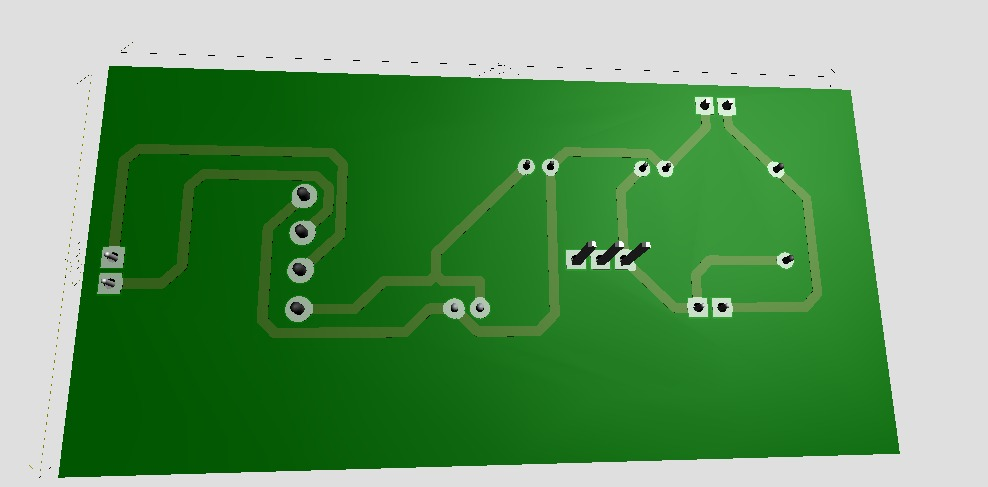

# Protótipo de Fonte de Alimentação com Regulador 7812

Este projeto apresenta o desenvolvimento de uma fonte de alimentação regulada, projetada no software Proteus para a disciplina de Sistemas Embarcados. O circuito realiza a retificação, filtragem e regulação de tensão para fornecer uma saída estável de 12V.

## 🛠️ Especificações Técnicas
- **Entrada:** Conector J1 (AC/DC)
- **Retificação:** Ponte Retificadora (BR1)
- **Regulação:** CI 7812 (U2) - Saída de 12V DC
- **Indicação:** LED de status (D1) com resistor limitador (R1)
- **Dimensões da Placa:** 80mm x 40mm

## 📸 Demonstração do Projeto

### Esquema Elétrico
O diagrama mostra a entrada passando pela ponte retificadora, seguida pelos capacitores de filtragem para reduzir o ripple antes de entrar no regulador.

### Layout da PCB
Design das trilhas (Bottom Layer) e posicionamento dos componentes.

### Visualização 3D
Vista frontal (componentes) e vista posterior (trilhas de cobre) da placa finalizada.

### Guia de Componentes e Funcionamento
Entrada (J1): Conector para entrada de tensão alternada (AC).

Ponte Retificadora (BR1): Realiza a retificação de onda completa, transformando a corrente alternada em contínua pulsante.

Filtragem Principal (C1): Capacitor eletrolítico de $1000\mu F$ que atua como filtro para reduzir o Ripple (oscilação na tensão), mantendo o nível DC mais estável.

Desacoplamento (C2 e C3): Capacitores cerâmicos de $100nF$ que eliminam ruídos de alta frequência e estabilizam o regulador contra oscilações rápidas.

Regulação (U2 - 7812): Circuito integrado responsável por manter a saída fixa em 12V, independentemente de pequenas variações na entrada.

Indicação Visual (D1 e R1): LED de status que indica se a placa está energizada, protegido pelo resistor R1 de $100\Omega$.

Saída (J2): Terminal de saída para alimentação do circuito/carga externa.